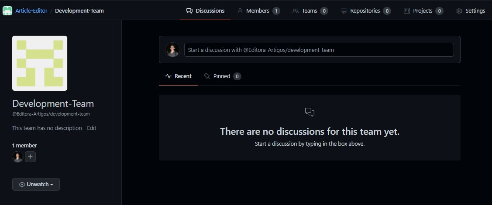

# Sumário

 1. [Introdução](#introducao)
 2. [Equipes no GitHub](#equipes-no-github)
 3. [Criando uma equipe](#criando-uma-equipe)
 4. [Página inicial](#pagina-inicial)
 5. [Página de membros](#pagina-de-membros)
 8. [Página de repositórios](#pagina-de-repositorios)
 9. [Página de projetos](#pagina-de-projetos)
 10. [Página de configurações](#pagina-de-configuracoes)
 11. [Agora é com você](#agora-e-com-voce)
 12. [Continue lendo](#continue-lendo)
 13. [Referências](#ref)

 

# Introdução

Já conhecemos a confunsão ao surgir a necessidade de modificar o acesso de um certo grupo de pessoas em um repositório quando não utilizamos o recurso de equipes. Quando em vez de um repositório temos vários onde pessoas diferentes(ou as mesmas pessoas) possuem níveis de acesso diferentes a situação fica ainda mais confusa. O recurso de equipes do GitHub é uma ferramenta que existe para nos auxiliar nestes processos.

 

# Equipes no GitHub

Ter visibilidade do trabalho em desenvolvimento por cada equipe e seus membros é uma das muitas formas de melhorar a produtividade. Identificar rapidamente problemas como queda de performance dos membros ou entregas pouco frequentes é crucial para a entrega de valor.

Alguns recursos como permissões de criação, edição ou apenas leitura. Notificar todos os membros apenas citando a equipe, importar permissões de várias pessoas da equipe ao mesmo tempo através da associação da equipe ao projeto e/ou repositório. São apenas algumas das diversas funções do recurso de equipe. Então acompanhe abaixo como começar a explorar este recurso.

 

# Criando uma Equipe

Diferente dos projetos que podem ser acessados a partir de outros contextos como organizações, usuários e repositórios. As equipes podems ser acessadas apenas através da organização à qual pertencem.

Entrando na página da organização podemos encontrar a opção do recursos de equipe no menu como mostrado no exemplo abaixo:

Logo em seguida veremos a opção de criar uma nova equipe abaixo do menu.

Agora veremos um formulário como mostrado abaixo:

Aqui é necessário informar o nome da equipe. Se necessário uma descrição e logo abaixo podemos escolher uma equipe primária caso exista. Ignore caso não tenha outra equipe para definir como primária ou caso simplesmente desconsidere necessário.

Como último passo é preciso informar a visibilidade da equipe. Isto é, definir como secreta caso a equipe seja privada. Assim apenas os membros da equipe poderão vê-la e pública caso julgue que não há razão para manter a equipe oculta.

Acabando de criar a equipe poderemos entrar na página de visualização:

 

# Página inicial

A visualização inicial são as discussões existentes dentro da equipe. Esta visualização é muito útil para Avisos gerais, processos de idealização e instruções. Aqui todos os membros da equipe podem visualizar e participar.

 

# Página de membros

Nesta página podemos ver todos os membros da equipe, agrupar a visualização por nível de permissão e caso tenha o nível requerido você pode gerenciar membros.

## Adicionando um membro à equipe

`Nota 1`: Observe que o nome de cada membro da equipe é um hyper texto(texto contendo um link) que ao ser clicado redireciona para a página da pessoa dentro da organização(que será detalhado no artigo *'Gestão de organizações com GitHub'*)

Na figura anterior é possível ver um botão verde para adicionar um membro. Ao clicar nele surgirá uma caixa de diálogo solicitando o nome de usuário, e-mail ou nome completo da pessoa que será adicionada. Basta informar uma dessas informações e surgirá uma lista abaixo da caixa de texto com o resultado da pesquisa baseada na informação inserida. Selecione o usuário que deseja e clique em Enviar. Agora a pessoa receberá uma notificação por e-mail e pode responder ao convite.

`Nota 2`: Podemos observar também que há um item de equipes no menu das equipes. Aqui é possível encontrar as equipes secundárias. Abordaremos este recurso em um artigo futuro.

 

# Página de repositórios

Na página de repositórios veremos todos os repositórios dos quais as equipes fazem parte e outra vez, caso o usuário tenha o nível de acesso requerido poderá vincular um repositório à equipe. Para isto uma caixa de diálogo será exibida ao clicar no botão de adicionar repositório e ao informar o nome ou parte do caminho do repositório uma lista de resultados aparecerá onde é possível selecionar a opção desejada e salvar. Verifique o exemplo abaixo:

![link-repository-to-team](images/link-repository-to-team.jpg]

 

# Página de projetos

Assim como a página de repositórios, esta página tem uma visualização para todos os projetos dos quais a equipe está vinculada.

`Nota 3`: No final deste artigo há uma referência para um artigo sobre a*´Gestão de projetos com GitHub´*.

 

# Página de configurações

Por fim temos a página de configurações. Esta contém opções para deletar a equipe, modificar a visibilidade e também associação à outras equipes como descrito no momento da criação. Também é possível adicionar notificações agendadas através de vinculo com o Slack e opções de notificação para revisão de código.

 

# Agora é com você

O objetivo deste artigo é introduzir ao recurso de equipes, mostrando as ferramentas fundamentais do recurso. Utilize estes recursos em projetos pessoais e explore a usabilidade, analise os resultados e assim desenvolverá experiência para o uso no ambiente de trabalho.

 

# Continue lendo:

[Gestão de projetos com GitHub](https://balta.io/blog/gestao-de-projetos-com-github)

[ASP.NET Deploy com GitHub Actions e Microsoft Azurel](https://balta.io/blog/aspnet-deploy-github-actions-azure)

[GitHub Packages e GitHub Actions - Distribuindo contextos delimitados](https://balta.io/blog/github-packages-github-actions-distribuindo-contextos-delimitados)

## Cursos relacionados

`Gratuito` | [Fundamentos do Git e Azure DevOps](https://balta.io/cursos/fundamentos-git-azure-devops)

 

## Referências
[Documentação do GitHub](https://docs.github.com/)
