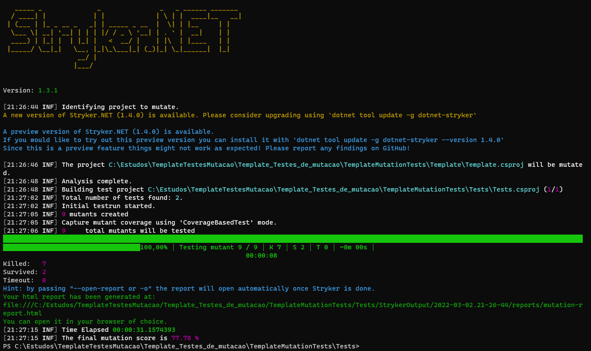
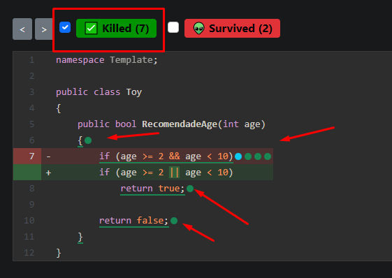
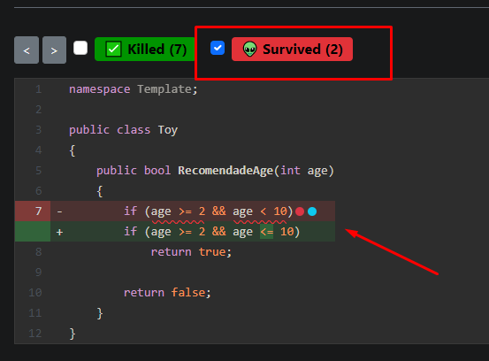

# Testes de mutação com Stryker.NET

Um pouco sobre a biblioteca
----
Stryker.NET é uma biblioteca que oferece testes de mutação para .NET, ele permite que você teste seus testes unitários inserindo bugs temporariamente, é importante lembrar que a biblioteca só pode ser usado para aplicações .net 5 e adiante

Sobre os testes
----
O teste de mutação ou testes mutantes são feitos para avaliarem a bateria de testes do seu código. O conceito é modificar uma parte do seu código, implementando bugs ou "mutantes" fazendo com que seus testes quebrem e encontrando possíveis falhas ou erros. Seus testes são executados para cada mutante. Se seus testes falharem, o mutante sobrevive. Se seus testes passarem, o mutante é morto. Quanto maior a porcentagem de mutantes mortos, mais eficazes serão seus testes.

Os estados dos mutantes:
* Killed: Quando pelo menos um teste falhou enquanto este mutante estava ativo, o mutante é morto
* Survived: Quando todos os testes passaram enquanto este mutante estava ativo, o mutante sobreviveu.
* No Coverage: O mutante não é coberto por um de seus testes e sobreviveu como resultado. 

Iniciando o projeto
----
Neste exemplo utilizaremos o xunity para nossos testes, você poderá estar utilizando este [Template](https://github.com/Eliandro-Freitas/TemplateMutationTests.git) com as classes e os testes já implementadas para adiantar o processo ou clonando o projeto diretamente pelo link https://github.com/Eliandro-Freitas/TemplateMutationTests.git

Com o template aberto teremos uma classe chamada **Toy** com um método **RecomendadeAge** 
Temos uma situação que esse brinquedo é recomendado para crianças entre 2 e 10 anos
```csharp
public class Toy
{
    public bool RecomendadeAge(int age)
    {
        if (age >= 2 && age < 10)
            return true;

        return false;
    }
}
```

Apenas com esses dois métodos teremos testados as duas condicionais e os testes irão passar, mas a nossa demanda não será atendida, precisamos que a idade seja entre 2 e 10 anos e aqui está até 9 anos, é apenas um sinal  de '=' que as vezes passa despercebido que poderá trazer um BUG na hora de rodar seu código em produção
```csharp
public class ToyTests
{
    [Fact]
    public void ShouldReturnTrueWhenAgeIsRecomendade()
    {
        var result = new Toy().RecomendadeAge(4);
        result.Should().BeTrue();
    }

    [Fact]
    public void ShouldReturnFalseWhenAgeIsNotRecomendade()
    {
        var result = new Toy().RecomendadeAge(15);
        result.Should().BeFalse();
    }
}
```

Agora vamos adicionar a biblioteca
----
Com o template em mãos ou no seu projeto de preferência, entre no package manager console do visual studio ou entre na pasta com o cmd ou powerShell onde seu projeto principal foi criado e execute o comando

```dotnet tool install -g dotnet-stryker```

E rodar o Stryker
----
No windows explorer navegue até onde está salvo o arquivo csproj do seu projeto de testes e digite o comando ```dotnet Stryker``` e de enter para executar

### Você verá uma janela como essa 




### Copie a URL gerada e cole no seu browser de preferência para abrir o relatório


Com o browser aberto teremos nosso relatório mostrando quantos mutantes foram criados, sobreviveram ou morreram com as mutações criadas e também o nosso **score** , o mais importante para nós são a quantidade de mutantes que sobreviveram aos testes, eles são indicativos de testes que estão faltando


Ao selecionar a box de killed poderemos ver todas as alterações que foram feitas no código e que passaram nos nossos testes, cada bolinha verde mostrará uma alteração feita



Selecionando a box de Survived será mostrando todas as alterações feitas e que fizeram os testes falharem e mostrando possíveis alterações para melhorar o código, mas fique atento, nem todas alterações recomendadas atendem nossas necessidades, temos que saber analisar e usar o que for necessário para nossa regra de negócio, assim



Tendo todos esses dados, iremos ajustar nosso método e melhorar os testes
Vamos adicionar mais uma condicional no método para que seja aceito a idade de 10 anos também
```csharp
public bool RecomendadeAge(int age)
{
    if (age >= 2 && age <= 10)
        return true;

    return false;
}
```
E vamos adicionar alguns parametros nos nossos testes para ele ficar mais dinâmico e cobrir uma quantidade maior de possibilidade
```csharp
[Theory]
[InlineData(2)]
[InlineData(4)]
[InlineData(10)]
public void ShouldReturnTrueWhenAgeIsRecomendade(int age)
{
    var result = new Toy().RecomendadeAge(age);
    result.Should().BeTrue();
}

[Theory]
[InlineData(1)]
[InlineData(11)]
[InlineData(15)]
public void ShouldReturnFalseWhenAgeIsNotRecomendade(int age)
{
    var result = new Toy().RecomendadeAge(age);
    result.Should().BeFalse();
}
```

Vamos rodar nossos testes e ver se todos passam


Os testes continuam passando, agora vamos novamente executar o comando ```dotnet Stryker``` cmd ou powerShell na pasta onde está nosso projeto de testes, em seguida copiar a URL gerada e abrir no browser para podermos usar o relatório.
Com ele aberto ja teremos nosso relatório, mostrando todas as alterações feitas em nosso método e a quantidade que mutantes de sobreviveram ou morreram aos testes


Na imagem acima ja podemos ver que nenhum mutante sobreviveu, todos nossos testes passaram e nosso método está de acordo com nossa regra de negócio

Considerações finais
---
Nossos códigos nem sempre vão estar cobertos totalmente pelos testes, os testes de mutação podem nos ajudar a criar novos cenários e a ajudar o programador a prevenir possíveis bugs, aqui tivemos um exemplo simples, apenas para mostrar a biblioteca e falar um pouco sobre os testes de mutação, mas com projetos reais a quantidade de combinações criadas pode crescer muito, com isso criando vários cenários e ajudando o programadores a melhorar os testes, vale lembrar que nem todas as alterações recomendadas quando um mutante sobrevive são as melhores para nossa regra de negócio, devemos saber analisar para utilizar a melhor recomendação

Referências [Stryker.NET](https://stryker-mutator.io/docs/mutation-testing-elements/mutant-states-and-metrics/)

### Espero que tenham gostado e que eu tenha conseguido compartilhar um pouco de conhecimento
